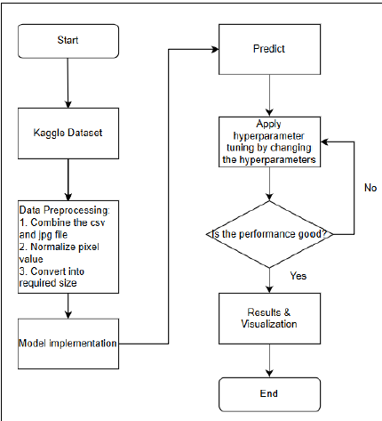
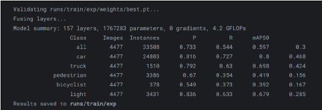
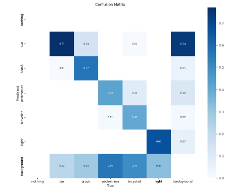

# Object-Detection-for-Autonomous-Vehicle-Perception

## Background
Computer vision is a field of AI that teaches the computer to recognize images. The computer is trained with bunch of images and it try to learn the patterns behind the images. In our project, we are trying to apply it in the autonomous vehicle industry, which means to detect the object arround the vehicles to enhance the decision making and road planning process. 

Deep learning is capable of dealing with the huge ammount of data for the images. For instances, a 1000 by 1000 images will represent 3M inputs, the basic machine learning model is not able to deal with this huge ammount of data. Besides, it is important to detect nearby vehicles, pedestrians and cyclists to avoid collisions. A high accuracy model is important for the safety of the road users.

##  Objective & Aim
The project aims to develop a model that is able to accurately identify and classify various road 
objects, including vehicles, pedestrians, and traffic lights, in real-time. Following objectives will 
be achieved:
1. To collect and pre-process the data, in the form that it can be used for training.
2. To perform an implementation of the Deep Learning model.
3. To perform hyperparameter tuning to improve the performance.
4. To validate and compare the results of the model with results done by others.

## Methods

## Results

The validation of the final model shows key performance metrcis for each classes. There are 4477 images used for validation, with 33k instances across all classes. A 73.3% precision indicates that the percentage of correct predictions among all detected objects. The mAP at 50% IOU is 59.7% indicates that the model can achieve a mean precision of 59.7% if the model detects the object with an IOU of 50%.

If we compare through each classes, we find that the cars are more easily detected, this might be due to the high ammount of images related to car (24k). Do note that YOLO is hard to detect smaller objects, this matches the case when classes have smaller size, such as pedestrian and bicyclist, which have lower P (Prescision) and R (Recall) value if compared to 
classes with larger size, such as the truck and light. This suggests us increase the pedestrian and 
bicyclist class to the dataset, so that the model can learning more features about them. 

- 57% of trucks are correctly predicted
- Only 40% and 42% of pedestrians and bicyclists are correctly predicted
- The light and car are the top 2 correctly predicted class
- The images with no objects are labeled as background, and 74% of it is identified as cars.
  

## Reference to coding:
https://www.kaggle.com/code/arushupadhyaya/yolo-8-od
https://www.kaggle.com/code/saeedsarrafzadeh/yolov5-v8-object-detection
